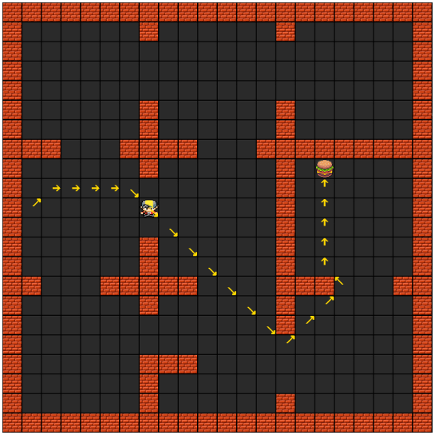

# Reinforcement learning and state space search algorithms

#### Reinforcement learning 
1. The objective is to have an agent searching for a reward in a discrete environment.
2. Prior to implementing the solution, the whole software architecture of the system was created.
2. To do this, the following algorithms were used:
- SARSA
- Q-Learning
- QME
- Dyna-Q

<table>
  <tr>
    <td></td>
    <td></td>
    <td></td>
</tr>
  <tr>
    <td style="text-align: center;"><em>1. Experience before finding the objective</em></td>
    <td style="text-align: center;"><em>2. Experience after finding some times the solution</em></td>
    <td style="text-align: center;"><em>3. Experience after finding multiple times the solution</em></td>
  </tr>
</table>

--------------------------

#### State space search

1. The objective is to for the agent to create a route from where he is to the objective using a state space search algorithm. 
2. Additionally create a optimization algorithm using hill climbing and simulated annealing.
2. In the state space search, two algorithms were used which were:
- Weighted A*
- Wavefront

<table>
  <tr>
    <td></td>
    <td></td>
    <td></td>
</tr>
  <tr>
    <td style="text-align: center;"><em>1. Weighted A* with weight equal to 0</em></td>
    <td style="text-align: center;"><em>2. Weighted A* with weight equal to 5</em></td>
    <td style="text-align: center;"><em>3. Wavefront algorithm</em></td>
  </tr>
</table>

<table>
  <tr>
    <td></td>
</tr>
  <tr>
    <td style="text-align: center;"><em>4. Simulated Annealing for N queens problem</em></td>
  </tr>
</table>

--------------------------

#### Organization of the reinforcement_learning:
- Go to folder reinforcement_learning/iasc-obj-2
- Inside **"doc"** -> architecture files obtained

- Inside **"src"**
    - **lib** is the implementation
    - **test** is the files to run

- To execute use the file **env.bat**.
- To test all the algorithms you must go to the file: ***test_reinforcement.py***.
- Then uncomment the desired type of algorithm "control" and comment the current one.
- To test in another environment, change the variable "agent".
- To change the speed of execution, click on the **F** key.

--------------------------

#### Organization of the state_space_search
- For the state space search - **iasc-obj-3**
- Inside **doc** -> architecture files obtained

- Inside **src** 
    - **lib** is the implementation
    - **test** is the files to execute
				   
- Within test -> agent is the discrete agent
                 -> locations is a test with locations
				 
- Inside the agent 
    - ***test_sss.py*** file is the A* weighted search
    - ***test_wavefront.py*** is the front-wave method
				  
- To run it use the file ***test_sss.bat*** for A* weighted search
- To run front-wavefront use the file ***test_wavefront.bat***
- To change the weights or environment change in the file ***test_sss.py*** for A* weighted search
- To change the environment in the wavefront use ***test_wavefront.py***, 
- argument True in AgentControl is to restart when it reaches all targets
- Click ***F*** to change execution speed

### optimization 
- **optimizacao**
- Inside **doc** -> obtained architecture files

- Inside **src** 
    - **lib** is the implementation
    - **test** is the files to run
				   
- To execute use the file **env_n_queens.bat** for the N-queens problem
- To execute the traveling salesman use **env_travelling_salesman.bat**
- The cost output appears in the cmd console
- To use classic Hill-Climbing is to change the .py file inside the	